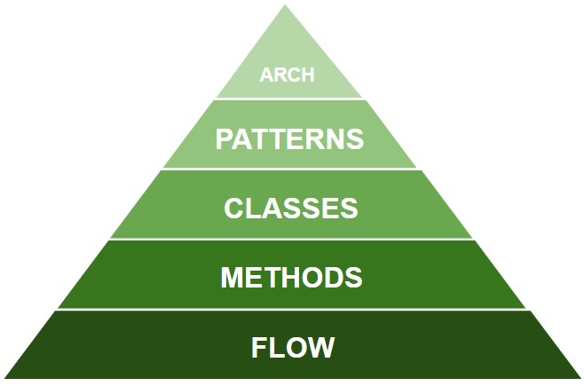

# Pyramid of Refactoring

Corypight (c) 2018 IT Train Wlodzimierz Krakowski (www.refactoring.pl)

This code is inspired by Joshua Kerievsky's book "Refactoring to Patterns"
but the refactorings used during talk are more sophisticated as
extract delegate, extract functional parameter, Java 8 streams and much more
other code-transformations have been used.

It is used as sample to explain my own concept of "Pyramid of Refactoring"
and to perform live-refactoring during the talk "Pyramid of Refactoring"
and present the levels of pyramid.

Levels:
- Flow (replace loop with pipeline, slide statements)
- Methods (extract isSatisfiedBy method)
- Classes (extract delegate, extract functional parameter, move anonymous into class)
- Patterns (extract interface Spec, introduce Interpreter Design Pattern)
- Architectures (more specs into "spec" subpackages according to Dependency Inversion Principle)

Please note that 
- each sample from "Refactoring to Patterns" (by Joshua Kerievsky)
can be divided into parts beloning to each level of pyramid.
- each sample from "Refactoring" (by Marcin Fowler) can be placed
somewhere within the pyramid.

